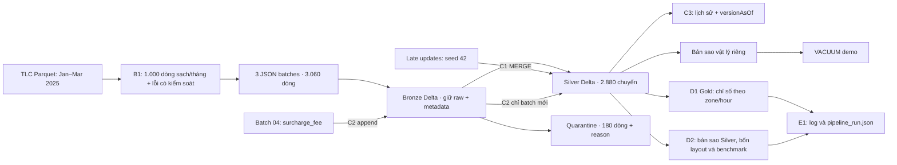
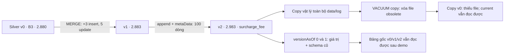
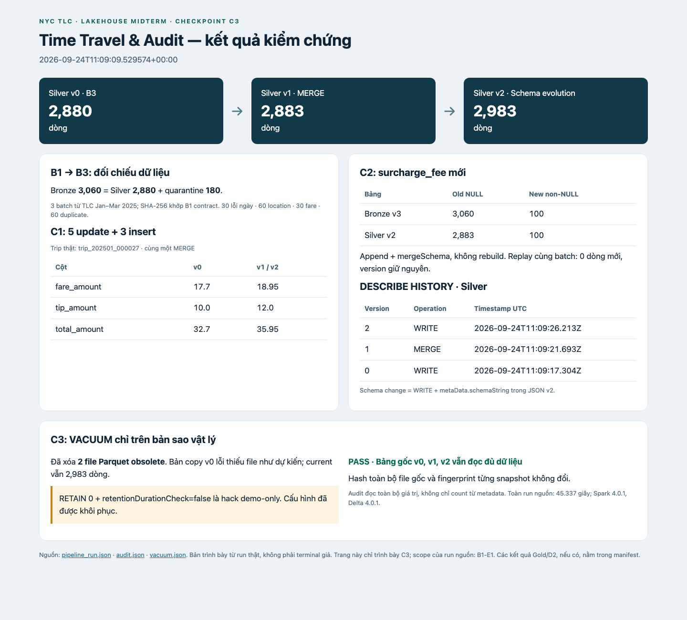
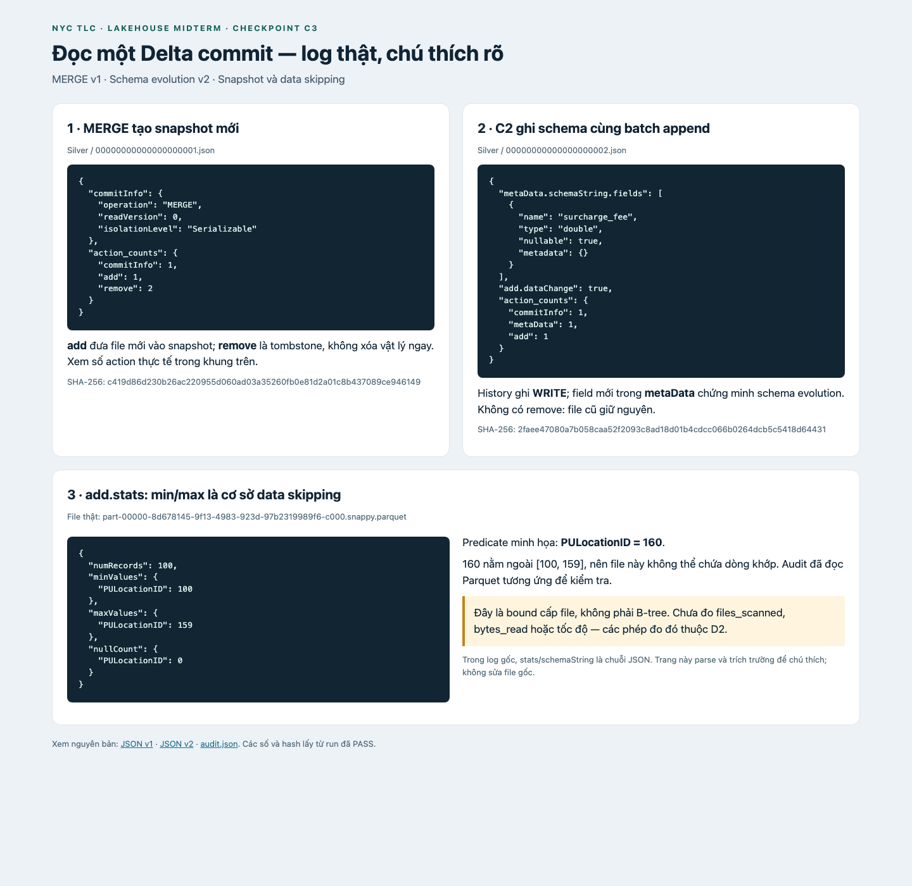
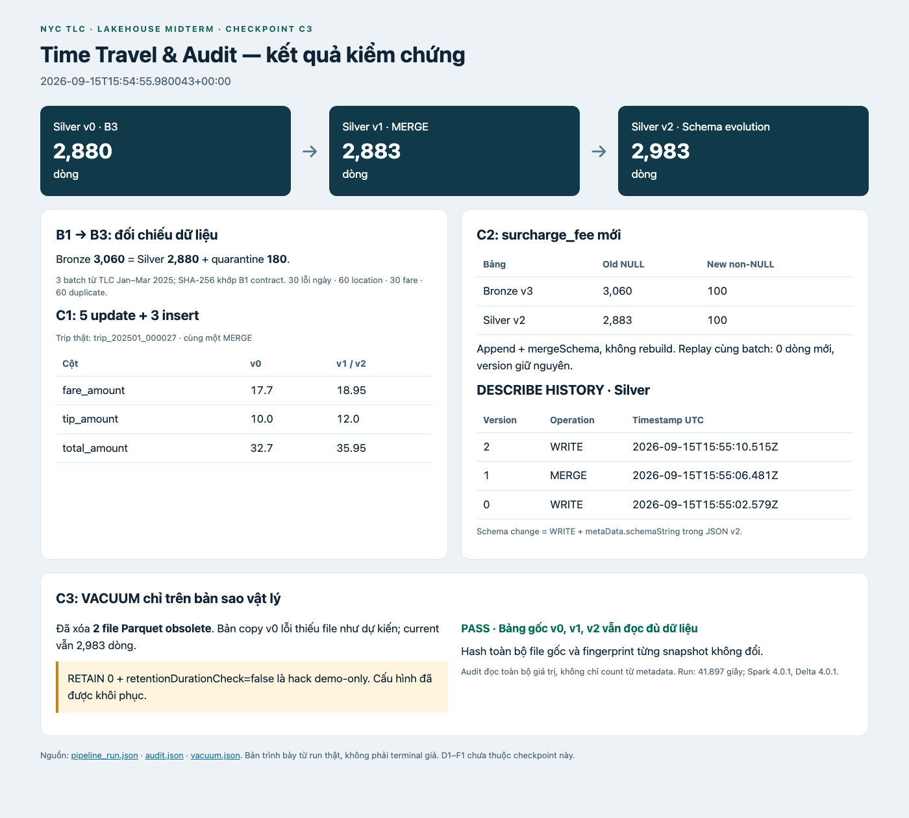
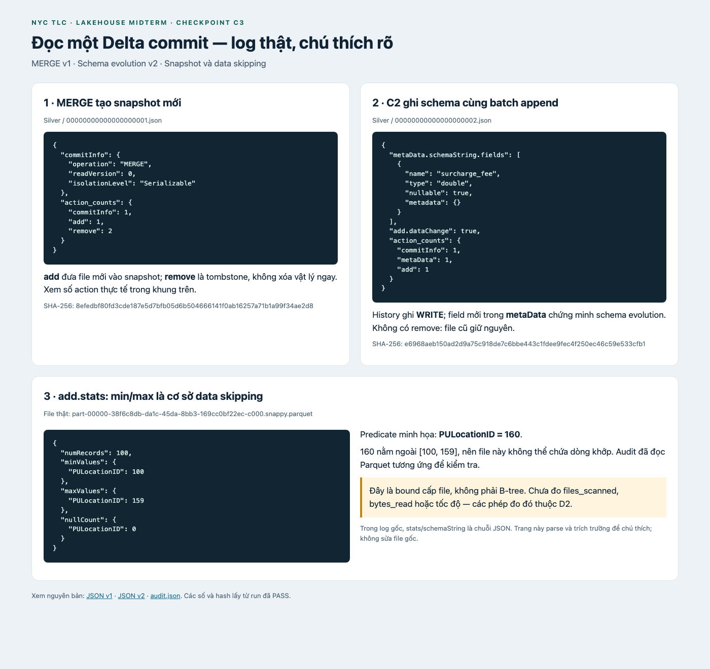

# Delta Lakehouse Architecture & Storage Optimization

Báo cáo kỹ thuật cho phạm vi **A1–E1** của bảng phân công cập nhật: nền tảng,
kiến trúc, Bronze/Silver, CDC, schema evolution, time travel, Gold, benchmark và
runner tích hợp. [Bảng nghiệm thu](docs/MILESTONE_STATUS.md) phân biệt code đã
có với evidence thực thi. E2 (chạy lại toàn pipeline để kiểm idempotency) và F1
(deck, rehearsal 10–15 phút) là các milestone riêng.

## 1. Phạm vi và đối chiếu rubric

Runtime được ghim ở PySpark 4.0.1 / Delta Lake 4.0.1, Python 3.11 và Java 17.
Điểm xuất phát là TLC Parquet tháng 01–03/2025. B1 tạo ba JSON fixture có
3.060 dòng với lỗi chủ đích, không thay đổi dữ liệu TLC gốc. Mỗi lần chạy dùng
thư mục mới, giữ nguyên các snapshot và evidence của lần chạy trước.

| Milestone | Sản phẩm trong repo | Tiêu chí nghiệm thu |
|---|---|---|
| A1 | README, requirements, config, runner, report, `docs/SLIDE_OUTLINE.md` | Môi trường, entry point, branch convention và khung slide rõ ràng |
| A2 | Mục 2–3, [sơ đồ kiến trúc](docs/architecture.md) | So sánh ba kiến trúc, Delta, phân tầng và phản biện |
| B1 | `src/generator.py`, contract, manifest, checksums | Ba batch có đủ bốn nhóm lỗi, nguồn TLC kiểm chứng được |
| B2 | `src/bronze.py` | 3.060 dòng, đủ metadata, không loại lỗi |
| B3 | `src/silver.py`, tests | 2.880 Silver + 180 quarantine, đúng B1-v1.0 |
| C1 | `src/cdc_merge.py` | Một MERGE có update và insert; đối chiếu giá trị lẫn số dòng |
| C2 | `src/schema_evolution.py` | Append hai tầng, schema mới, dòng cũ NULL, replay không trùng |
| C3 | `src/time_travel.py`, evidence | Hai version cũ đọc được, history/log thật, VACUUM bản sao |
| D1 | `src/gold.py`, tests | AVG tip/fare theo chuyến, earnings theo contract, UTC, đối chiếu SQL |
| D2 | `optimization_benchmark.py`, tests, kết quả | Bốn layout bắt buộc, ≥3 lượt xen kẽ, metrics thực và giới hạn phép đo |
| E1 | `lakehouse_pipeline.py`, config, `docs/pipeline_run.json` | Một lệnh từ JSON qua Gold và benchmark, log từng bước |
| E2/F1 | Các mục 11–12 | Nghiệm thu riêng sau E1; không đồng nhất với unit test hoặc khung slide |

Rubric gốc dành 30 điểm cho lý thuyết, 25 cho Medallion pipeline, 25 cho
upsert/schema evolution/time travel, 10 cho tối ưu và 10 cho code/demo. Repo
cung cấp evidence để đối chiếu rubric; báo cáo không tự quy đổi thành điểm số.

## 2. Data Warehouse, Data Lake và Lakehouse

| Góc nhìn | Data Warehouse | Data Lake | Lakehouse |
|---|---|---|---|
| Tổ chức dữ liệu | Bảng có mô hình phục vụ phân tích | File trên HDFS/object storage | File mở cùng metadata và giao dịch cấp bảng |
| Schema | Thường chuẩn hóa trước khi nạp | Diễn giải khi đọc | Giữ landing linh hoạt; enforce/evolve tại bảng |
| Công việc phù hợp | SQL, BI, mô hình nghiệp vụ ổn định | Lưu raw, xử lý nhiều dạng dữ liệu | SQL, data engineering, ML trên bảng dùng chung |
| Trách nhiệm vận hành | Mô hình hóa và tải vào hệ quản trị | Tự quản lý chất lượng, version, tính nhất quán | Quản lý log, retention, bố trí file, engine tương thích |

Đây là so sánh định hướng, không phải khẳng định mọi warehouse hiện đại đều
đóng hoặc mọi data lake đều thiếu governance. Armbrust et al. đề xuất kết hợp
định dạng mở, quản lý đáng tin cậy và phân tích nâng cao để giảm số hệ thống
phải đồng bộ. Kết quả của một hệ thống trong bài báo không chứng minh lakehouse
luôn nhanh/rẻ hơn warehouse trong mọi workload.
[Armbrust et al., CIDR 2021](https://www.cidrdb.org/cidr2021/papers/cidr2021_paper17.pdf).

Trong project, Delta bổ sung transaction log trên Parquet. Schema enforcement
kiểm tra tương thích khi ghi; schema evolution cho phép thêm cột có chủ đích.
Chất lượng nghiệp vụ vẫn do code đảm nhiệm: Delta không tự biết fare âm là lỗi,
cũng không tự đảm bảo `trip_id` duy nhất theo contract của nhóm.

## 3. Medallion Architecture và giới hạn thiết kế



Bronze lưu bằng chứng nguồn và ba cột provenance, giúp đối chiếu/reprocess.
Silver có kiểu nhất quán và khóa đã dedup, phù hợp làm đầu vào cho CDC và phân tích.
Quarantine lưu giá trị raw cùng lý do; nhóm có thể giải thích tại sao một chuyến
không được đưa vào Silver. Gold chuyển dữ liệu chuyến thành chỉ số nghiệp vụ theo khu vực và giờ UTC.
Ba tầng là quy ước tổ chức của pipeline, không phải ba loại format Delta khác nhau.

Phản biện của nhóm: mỗi lần materialize qua một tầng tăng I/O, dung lượng và độ
trễ; dữ liệu Bronze mới có thể chưa xuất hiện ở Silver nếu bước sau thất bại.
Một thiết kế producer-centric, trong đó Silver chỉ sao chép cấu trúc từng nguồn,
còn đẩy việc thống nhất định nghĩa
sang người dùng. Vì vậy cần contract chung, provenance và kiểm tra theo nhu cầu
phân tích, không thêm tầng chỉ vì tên kiến trúc. Batch nhỏ và máy local ở đây
minh họa ngữ nghĩa, chưa đánh giá SLA streaming hay khả năng scale.

## 4. B1–B3: nguồn, contract và chất lượng

Nguồn là ba Parquet Yellow Taxi chính thức tháng 01–03/2025, đã lưu số dòng,
kích thước và SHA-256 ở [source manifest](docs/source_data_manifest.md).
B1 lấy 1.000 dòng hợp lệ đầu tiên mỗi tháng, gán ID và chèn lỗi seed cố định.
Đây không phải mẫu xác suất đại diện toàn NYC. `trip_id` là khóa do project tạo.
Runner kiểm SHA-256 ba JSON trước khi xử lý; không tải lại dữ liệu mỗi lần chạy.

| Nhóm rejected | Mỗi batch | Tổng ba batch |
|---|---:|---:|
| INVALID_PICKUP_DATETIME | 10 | 30 |
| MISSING_LOCATION (PU hoặc DO) | 20 | 60 |
| INVALID_FARE (fare ≤ 0) | 10 | 30 |
| DUPLICATE_TRIP (bản dư) | 20 | 60 |
| Tổng | 60 | 180 |

Bronze append đủ 1.020 dòng/batch và gắn `_ingest_ts`, `_source_file`, `_batch_id`.
Silver dùng parser `CORRECTED`, UTC, format `yyyy-MM-dd HH:mm:ss`, và phép chuyển
kiểu an toàn trong ANSI mode. Sau loại lỗi pickup/location/fare, dedup dùng
`dropDuplicates(["trip_id"])`. Quarantine giữ N−1 bản dư bằng multiset subtraction.
Đối chiếu 2.880 + 180 = 3.060 diễn ra trước khi ghi Silver.

Không thêm rule thứ năm: ví dụ fare NULL/không parse được không tự động thỏa
`fare <= 0`. Đây là giới hạn cố ý của contract B1-v1.0; production cần một quyết
định nghiệp vụ riêng. B3 là rebuild: phải chạy trước C1/C2, vì overwrite sau CDC
sẽ thay current state. Bronze và hai output B3 là các transaction riêng.

## 5. C1: CDC và MERGE INTO

CDC là cách chuyển thay đổi của nguồn sang downstream thay vì tải lại toàn bộ
trạng thái. Một thiết kế thực tế còn cần event ID, thứ tự/offset, delete và chính
sách xử lý sự kiện cũ đến muộn. Project mô phỏng một batch late-arriving bằng
Parquet; không triển khai connector đọc database log hoặc Delta Change Data Feed.

Fixture chọn khóa thật từ Silver theo thứ tự SHA-256 của `seed:trip_id`, seed 42.
Năm chuyến nhận fare +1,25, tip +2, total +3,25. Ba chuyến mới có khóa riêng và
đầy đủ cột Silver. Các số tiền là giá trị thay thế tuyệt đối được đóng băng trong
fixture; chạy lại fixture không cộng tiền lần nữa. Metadata của bản ghi cũ giữ nguyên;
bản ghi insert có provenance của fixture CDC.

Một MERGE match theo `trip_id`: matched chỉ update fare/tip/total khi giá trị khác;
unmatched insert toàn bộ dòng. Code kiểm duplicate key, schema và fixture trước ghi,
đếm matched/unmatched trước MERGE, rồi đối chiếu số dòng, mọi giá trị persisted và
operation metrics. Điều kiện của lần chạy mới là updated > 0 và
`after = before + inserted`. Replay hợp lệ có thể updated = 0.

```text
Silver trước: 2.880
Source CDC: 8 = 5 matched + 3 unmatched
MERGE: 5 updated + 3 inserted
Silver sau: 2.883
```

Chi tiết fixture và giá trị trước/sau nằm trong evidence. Mô hình này có một writer;
kiểm tra trước MERGE không phải cơ chế đảm bảo exactly-once cho nhiều writer hoặc
các batch CDC đến sai thứ tự. C1 kế thừa ý tưởng update ba cột từ branch
`feat/c1-cdc-merge` (`8f52b73`), bổ sung fixture, runtime và kiểm chứng để tích hợp B3.

## 6. C2: Schema Evolution ở cả Bronze và Silver

`batch_04.json` có 100 dòng tổng hợp và cột **surcharge_fee** kiểu double. Đây là
cột giả lập, khác `cbd_congestion_fee` của TLC 2025 mà B1 đã loại khỏi contract.
Bronze giữ raw rồi Silver chỉ xử lý batch mới bằng cùng parser/rules B3.
Cả hai dùng `append` + `mergeSchema=true`; không rebuild hoặc overwrite bảng.

Kết quả đã xác minh trên run mới: Bronze 3.160 dòng (3.060 cũ NULL, 100 mới có fee);
Silver 2.983 dòng (2.883 cũ NULL, 100 mới có fee). Kiểm tra multiset xác nhận dữ liệu
cũ còn nguyên. Retry cùng batch ID/nội dung không append lần hai; đổi nội dung mà
dùng lại ID bị từ chối. Hai tầng commit riêng, vì vậy retry sau khi Bronze thành
công nhưng Silver chưa chạy có thể tiếp tục ở Silver.

`DESCRIBE HISTORY` thể hiện commit `WRITE`, không có operation tên “SCHEMA EVOLUTION”.
Bằng chứng schema change phải kết hợp `metaData.schemaString` trong JSON commit
và so sánh schema lịch sử. Run mới có schema change ở Bronze v3 và Silver v2;
version không dùng chung giữa các bảng. Screenshot C2 cũ trong repo thuộc lần chạy
riêng của tác giả, không phải bằng chứng cho timeline tích hợp C1→C2→C3 này.

## 7. C3: Delta Log, ACID và Time Travel

### 7.1 Transaction log và snapshot

Delta lưu chuỗi commit có version trong `_delta_log`. Với run nhỏ này, JSON v0
mô tả khởi tạo; v1 ghi MERGE; v2 ghi append có schema mới. `add` đưa file vào
snapshot; `remove` loại file khỏi snapshot hiện tại nhưng chưa xóa vật lý.
`metaData` lưu schema và cấu hình; `protocol` nêu khả năng reader/writer cần có;
`commitInfo` hỗ trợ audit. Snapshot được dựng từ các action đến version chọn,
có thể bắt đầu từ checkpoint rồi áp dụng commit sau checkpoint.
[Delta protocol 4.0.1](https://github.com/delta-io/delta/blob/v4.0.1/PROTOCOL.md).

### 7.2 ACID, optimistic concurrency và isolation

Atomicity: một commit công bố tập thay đổi của một bảng. Consistency: engine
thực thi schema/protocol, còn rule nghiệp vụ do pipeline kiểm tra. Isolation:
reader tiếp tục đọc snapshot nhất quán; writer không làm reader thấy nửa kết quả.
Durability phụ thuộc log/data đã commit và bảo đảm của storage được hỗ trợ.
Writer dùng optimistic concurrency: đọc snapshot, ghi file mới, kiểm xung đột
với commit phát sinh rồi commit hoặc báo lỗi.
[Delta concurrency control](https://docs.delta.io/concurrency-control/).

Trong project, B3 pin version Bronze, C1/C3 đọc `versionAsOf` rõ ràng. Các phép
so sánh đọc toàn bộ giá trị để tránh count được tối ưu chỉ từ metadata. Thí nghiệm
này xác minh lịch sử tuần tự; không giả nhận đã stress-test nhiều writer. ACID
của một bảng không biến Bronze→Silver hoặc Silver→quarantine thành transaction
xuyên nhiều bảng. Read snapshot isolation cũng không có nghĩa hai writer sửa
cùng dữ liệu sẽ luôn cùng thành công.

### 7.3 Timeline kiểm chứng



`audit.json` lưu count, schema, SHA-256 của tập giá trị đã materialize, một trip
cập nhật và số khóa insert nhìn thấy ở từng version. Hai version 0 và 1 đều là
version cũ sau C2. C3 kiểm v0 có số tiền cũ, v1/v2 có số tiền đã sửa; v0 chưa có
ba insert; v0/v1 chưa có cột fee. History của cả Bronze và Silver cùng JSON commit
được chép nguyên bản vào evidence, kèm hash.

### 7.4 VACUUM và retention

VACUUM xóa file dữ liệu không còn cần trong cửa sổ retention; nó không trực tiếp
xóa transaction log. Mặc định retention data là 7 ngày và log là 30 ngày. Giữ log
không đủ để đọc version nếu file Parquet của version đó đã bị xóa.
[Delta table utilities](https://docs.delta.io/delta-utility/).

Demo tạo **bản sao vật lý riêng**, gồm data và log, không dùng shallow clone/hardlink.
Code từ chối đường dẫn trùng/lồng nhau, symlink hoặc action trỏ ra ngoài bảng.
Chỉ trên bản copy mới này, tạm đặt
`spark.databricks.delta.retentionDurationCheck.enabled=false`, chạy DRY RUN rồi
`VACUUM ... RETAIN 0 HOURS`, và khôi phục cấu hình bằng `finally`.
**Đây là hack demo-only**, không phải cấu hình vận hành được khuyến nghị.

Nghiệm thu yêu cầu có file obsolete bị xóa thật, snapshot current của copy giữ
nguyên, version cũ của copy lỗi vì thiếu file, còn v0/v1/v2 của bảng gốc vẫn đọc
được và mọi hash file gốc giữ nguyên. Phần thất bại có chủ đích chỉ xảy ra ở copy;
không được che một exception Spark khác như thể đó là kết quả mong muốn.

### 7.5 Chú thích log và cơ chế data skipping

Mỗi `add.stats` là chuỗi JSON chứa `numRecords`, `minValues`, `maxValues`, `nullCount`.
Ví dụ, nếu file có PULocationID trong [100,159], predicate `PULocationID = 160`
không thể khớp file đó. Engine có thể bỏ file dựa trên bound; đây là thống kê cấp
file, không phải B-tree hoặc danh sách chính xác mọi giá trị. Nếu predicate nằm
trong khoảng thì vẫn có thể không có dòng khớp. Run sẽ dùng bounds thật của file
được chọn, không hardcode ví dụ này.
[Delta optimizations](https://docs.delta.io/optimizations-oss/).

Ảnh/log được trình bày từ action thực tế, có tên file và hash để truy ngược.
Min/max hiện diện không tự chứng minh một tỷ lệ tăng tốc hoặc số byte đã bỏ đọc;
đó là việc đo của D2. Bản audit chỉ xác minh bound với dữ liệu Parquet tương ứng.

## 8. Tái lập và nghiệm thu checkpoint

### 8.1 Nghiệm thu A1–E1 ngày 24/09/2026

Lệnh E1 đã chạy thành công với `data/e1_runs/official_20260924_verified`:
**45,337 giây** từ kiểm B1 đến hoàn tất D2 sau khi Spark khởi tạo, không gồm
thời gian tải dữ liệu/khởi động JVM. Regression suite riêng có **90 test PASS
trong 61,00 giây**. B1 được sinh lại từ ba Parquet chính thức và so sánh
byte-identical với ba JSON/manifest đã khóa.

| Kết quả | Giá trị |
|---|---:|
| B2 Bronze | 3.060 |
| B3 Silver / quarantine | 2.880 / 180 |
| C1 update / insert | 5 / 3 |
| C2 final Bronze / Silver | 3.160 / 2.983 |
| D1 Gold, zone × giờ trong ngày UTC | 152 nhóm, SUM(trip_count) = 2.983 |
| D2 bộ chính / compaction control | 36 / 18 lượt đo |

Đối chiếu độc lập bằng PyArrow xác nhận cả năm layout D2 giữ nguyên multiset
Silver; Gold có đủ 152 nhóm và số chuyến khớp. Code hashes, nguồn, tests và
kiểm chứng này nằm trong [validation.json](docs/evidence/e1/validation.json).
Các kết quả bất biến: [pipeline](docs/evidence/e1/pipeline_run.json),
[Gold](docs/evidence/e1/gold_run.json), [benchmark](docs/evidence/e1/benchmark_run.json),
[JUnit](docs/evidence/e1/tests.xml). `docs/pipeline_run.json` là bản manifest
mới nhất và có thể được cập nhật khi người dùng chạy lần tiếp theo.





### 8.2 Evidence C3 lịch sử và cách tái lập

Hướng dẫn chạy E1 nằm ở [README](README.md) và [runbook](docs/E1_RUNBOOK.md).
Mỗi run có thư mục mới; B2 chạy một lần, B3 trước C1/C2. Hướng dẫn và evidence
C3 lịch sử được giữ riêng ở [demo C3](docs/C3_TIME_TRAVEL.md).
Các test dùng thư mục tạm riêng. Evidence nghiệm thu được lưu trong
`docs/evidence/c3/`, còn Parquet và log Spark đầy đủ ở `data/` không đưa lên Git.
Phiên bản mở rộng tính fingerprint toàn bộ dòng bằng SHA-256 trong Spark,
sắp xếp theo 256 bucket logic và chỉ đưa các digest bucket về driver. Thuật
toán `spark-json-sha256-bucketed-multiset-v2` giữ cả số lần xuất hiện của dòng;
hash khác thuật toán cũ nên không so trực tiếp với hash trong evidence lịch sử.
Hash file cũng được đọc theo chunk. Xem [thí nghiệm mở rộng](docs/SCALING.md).

Evidence lịch sử, không đại diện cho lần E1 mới: lần nghiệm thu ngày 15/09/2026 tại `data/c3_demo/official_20260915_final`
hoàn thành trong **41,897 giây** (phần runner sau khi Spark khởi tạo, không gồm
download hay khởi động JVM). Silver v0/v1/v2 lần lượt 2.880/2.883/2.983 dòng;
Bronze cuối 3.160. VACUUM copy xóa 2 file cũ, original giữ nguyên cả ba version.
Regression suite có **15 test pass**, gồm 5 test B3 và 10 test Delta core.
Xem [kết quả run](docs/evidence/c3/pipeline_run.json),
[JUnit](docs/evidence/c3/tests.xml), [manifest code/evidence](docs/evidence/c3/manifest.json).





### 8.3 Mở rộng mẫu: 300 nghìn → 1,02 triệu → 3 triệu

Ba mức đã chạy độc lập toàn bộ B1–E1 với cùng seed 42, `local[4]`, heap 4 GiB,
16 shuffle partitions, baseline 256 file và target layout 1 MiB. Mỗi query/layout
có 5 lượt đo sau warmup: 60 lượt cho bốn điều kiện chính và 30 lượt compaction
ở mỗi mức. Thời gian dưới đây gồm khởi động Spark và toàn bộ kiểm chứng; khác
phạm vi thời gian runner của fixture ở mục 8.1.

| Dòng nguồn được chọn | Raw sau chèn lỗi | Silver cuối | Gold groups | Pipeline (giây) | RSS đỉnh quan sát (GiB) |
|---:|---:|---:|---:|---:|---:|
| 300.000 | 306.000 | 288.103 | 4.599 | 90,942 | 2,73 |
| 1.020.000 | 1.040.400 | 979.303 | 5.342 | 140,845 | 2,96 |
| 3.000.000 | 3.060.000 | 2.880.103 | 5.680 | 353,568 | 3,24 |

Mẫu lấy không hoàn lại, phân tầng theo ngày × giờ và phân bổ theo tỷ trọng
trong từng tháng. Cả ba tháng có số mẫu bằng nhau; tổng Gold mô tả bộ mẫu,
không phải ước lượng tổng NYC. Bộ lọc đủ điều kiện, SHA nguồn, seed, quota từng
giờ và digest vị trí dòng đều được lưu. Mỗi mức phủ đủ 90 ngày và 2.159 giờ
có dữ liệu đủ điều kiện. Fixture mặc định vẫn giữ nguyên checksum.

Ở mức 3 triệu, Q1 dùng Z-ORDER theo `PULocationID` giảm median từ 153,6873
xuống 45,2690 ms (70,54%), số file đọc 256 → 7. Q2 theo vùng và thời gian
dùng Z-ORDER hai cột giảm từ 177,6315 xuống 24,3129 ms (86,31%), số file
đọc 256 → 3. Cả bốn điều kiện, mọi query và từng lượt đo đều được giữ trong
báo cáo; không chọn bỏ trường hợp bất lợi. Đây là kết quả local warm-cache,
chưa chứng minh throughput production hay file đầu ra 1 GiB.

Spark kiểm tra multiset giữa các layout; một script độc lập dùng
PyArrow/Decimal đọc đúng snapshot Silver v2 và xác nhận toàn bộ **270 kết quả
timed + 54 warmup digest**. Xem [phương pháp và số liệu đầy đủ](docs/SCALING.md),
[manifest kiểm chứng/code hashes](docs/evidence/scaling/validation.json) và
[báo cáo D2 mức 3 triệu](docs/evidence/scaling/3000k/benchmark_report.md).
Bộ regression hiện tại đạt **118 test PASS** trong 77,33 giây; không có
failure, error hoặc skip. B1 mặc định được sinh lại và khớp từng byte với
fixture gốc, gồm cả error manifest.
Mức 3 triệu phù hợp làm benchmark chính trong bài; mức 1,02 triệu để thử
nhanh, fixture nhỏ để demo. Chưa đo giới hạn quy mô tối đa của máy.

## 9. Gold aggregation — D1

Gold được rebuild từ snapshot Silver sau C1/C2, theo `PULocationID` và giờ
trong ngày (0–23, Spark session UTC), dùng `zone_hourofday` như đề gốc. Timestamp
TLC gốc không có timezone: pipeline giữ giá trị giờ ghi trong nguồn, chưa
chuyển từ America/New_York sang UTC; không diễn giải chúng là thời điểm UTC
đã được hiệu chỉnh. Lựa chọn bổ sung
`zone_hour` phân biệt ngày và giờ (ví dụ 01/01 00:00 khác 01/02 00:00). Định nghĩa phải được
nêu cùng bảng số liệu, vì hai grain trả số nhóm khác nhau.

| Chỉ số | Định nghĩa |
|---|---|
| `trip_count` | Số chuyến trong nhóm |
| `avg_fare` | AVG(fare_amount) |
| `avg_tip_pct` | AVG(100 × tip_amount / fare_amount), chỉ tính tỷ lệ khi fare > 0 |
| `driver_earnings` | SUM(COALESCE(fare,0) + COALESCE(tip,0) + COALESCE(extra,0)) |
| `total_revenue` | SUM(total_amount), giữ đúng basis của trường nguồn |

`AVG(tip/fare)` cho trọng số bằng nhau giữa các chuyến có tỷ lệ hợp lệ;
`SUM(tip)/SUM(fare)` cho trọng số lớn hơn với chuyến có fare cao. Ví dụ hai
chuyến fare/tip = 10/2 và 100/10 có tip trung bình 15%, còn tỷ lệ tổng là
12/110 ≈ 10,91%. Mẫu số được bảo vệ để fare bằng 0 không gây lỗi ANSI.
`driver_earnings` là metric theo contract của bài, không ước lượng thu nhập ròng
sau chi phí vận hành của tài xế; tolls, thuế và các surcharge khác không được cộng.

Kiểm tra Gold phải đối chiếu số chuyến với Silver và từng nhóm với một truy vấn
SQL độc lập. Khi có tip NULL, AVG bỏ qua tỷ lệ NULL: trung bình gộp phải dùng số
chuyến có tỷ lệ hợp lệ, không dùng toàn bộ `trip_count` làm trọng số. B1 lấy
các dòng hợp lệ đầu tiên theo thứ tự file, nên số liệu phản ánh mẫu gần ranh giới
tháng; không suy rộng thành nhu cầu hay thu nhập trung bình của cả NYC.

Chi tiết công thức, test và số liệu của các run riêng: [D1 Gold](docs/D1_GOLD.md).
Con số 2.880 chuyến ở evidence B3 cũ không dùng thay cho 2.983 chuyến sau C1/C2.
Run E1 mới có 152 nhóm `zone_hourofday`; [Gold run](docs/evidence/e1/gold_run.json)
lưu kết quả kiểm tra SQL và hồ sơ mẫu dữ liệu.

## 10. Performance engineering và benchmark — D2

### 10.1 Small files, compaction và data skipping

Nhiều file nhỏ làm tăng số lần mở file, đọc metadata và lập lịch task. OPTIMIZE
bin-packing ghi lại các file nhỏ thành file lớn hơn; dữ liệu logic phải giữ
nguyên. Mục tiêu xấp xỉ 1 GB trong đề là kích thước file ở workload đủ lớn,
không phải lý do tạo padding hoặc giả nhận fixture 3.000 dòng là benchmark 1 GB.
Thí nghiệm local phải ghi target size thực và kích thước trước/sau.
[Delta optimizations](https://docs.delta.io/optimizations-oss/).

Z-ORDER bố trí dữ liệu theo các cột được chọn để min/max cấp file có thể loại
nhiều file hơn khi predicate phù hợp. Nó không phải B-tree, không đảm bảo tăng
tốc mọi truy vấn, và thêm nhiều cột có thể làm giảm mức tập trung trên từng cột.
Compaction chủ yếu giảm overhead số file; Z-ORDER còn thay đổi locality, nên
phải có nhánh compaction riêng để phân biệt hai tác động.
[Delta optimizations](https://docs.delta.io/optimizations-oss/).

Liquid clustering sử dụng `CLUSTER BY` và `OPTIMIZE FULL` trên bảng riêng. Đây
là điều kiện thứ tư trong phần VIỆC/Verify, không phải tên khác của Z-ORDER.
Không đặt Z-ORDER và liquid clustering trên cùng bảng. `OPTIMIZE FULL` có từ
Delta 3.3; runtime Delta 4.0.1 của project hỗ trợ câu lệnh này.
[Delta liquid clustering](https://docs.delta.io/delta-clustering/).

### 10.2 Thiết kế thí nghiệm và cách đọc kết quả

Bảng phân công có mâu thuẫn nội bộ: VIỆC/Verify yêu cầu bốn điều kiện, còn Done
when ghi ba trạng thái. Project lấy bốn điều kiện chi tiết làm bộ chính: baseline,
Z-ORDER một cột, Z-ORDER hai cột, liquid clustering + OPTIMIZE FULL. Nhánh
OPTIMIZE compaction được giữ làm phép đối chiếu bổ sung để vẫn thể hiện ba trạng
thái baseline/compaction/Z-ORDER của đề gốc.

Mọi nhánh là bản sao của cùng một snapshot Silver, không benchmark Gold. Pin
version nguồn, kiểm tra số dòng/giá trị, ghi số file và byte trước/sau từng thao
tác. Truy vấn 1D và 2D phải có kết quả khớp giữa các layout; ghi actual matching
rows, không dùng số dòng trả về của `COUNT(*)` làm số chuyến khớp. Các truy vấn
aggregate có thể luôn trả một dòng ngay cả khi predicate khớp 0 chuyến.

Các layout chính bắt đầu từ các bản copy byte-identical của baseline 32 file;
Silver được pin version và không bị thay đổi. Target 32.768 byte cho phép quan
sát nhiều file trên fixture nhỏ. Nhánh compaction bổ sung dùng target 1 GiB,
nhưng lượng dữ liệu thực nhỏ hơn rất nhiều target.

Sau một warmup mỗi query/layout, đo xen kẽ điều kiện 1,2,3,4 trong ít nhất ba
vòng: 3 queries × 4 conditions × 3 rounds = 36 lượt đo. Phase compaction riêng
chạy baseline/compacted theo cặp với warmup và 18 lượt đo; so median trong cùng
phase. Báo toàn bộ lượt, median và phần trăm cải thiện so với baseline. Giá trị cải thiện âm nghĩa
là chậm hơn trong phép đo này. `files_scanned` lấy từ counter
`numFiles` của Spark FileSourceScan đã thực thi. `bytes_read` lấy từ task input
bytes của các stage thuộc query, giữ job/stage IDs để truy ngược. Đây là bytes
ở filesystem, không phải physical disk traffic hoặc tổng dung lượng candidate
files trong Delta log. SQL/Delta planning hoàn tất trước bộ đếm giờ; thời gian
collect bao gồm task execution và truyền kết quả, không gồm chuẩn bị layout,
OPTIMIZE hay đọc metrics sau query.

Thiết kế và kết quả được sinh từ lần chạy: [D2 Performance](docs/D2_PERFORMANCE.md).
Run nghiệm thu `official_20260924_verified` đã PASS. Q1 khớp 69 chuyến:
baseline median 35,0211 ms, scan 32 file, filesystem input 526.985 byte;
Z-ORDER một cột median 22,3210 ms, scan 1 file, input 17.980 byte, cải thiện
36,26% trong lần chạy này. Q2/Q3 lần lượt khớp 26/74 chuyến. Mọi layout trả
kết quả bằng query trên Silver v2; không suy rộng mức tăng tốc này sang workload
production. [Kết quả bất biến của run](docs/evidence/e1/benchmark_run.json).

### 10.3 Threats to validity

Mẫu B1 nhỏ, không ngẫu nhiên, nên scheduling, khởi tạo task và JIT trong collect
có thể chiếm phần lớn latency. SQL/Delta planning được loại khỏi khoảng đo. File sau tối ưu có thể vẫn quá ít để phân biệt lợi ích skipping;
phải nhìn cả file/byte và thời gian, không suy tốc độ cluster lớn từ milliseconds
trên máy local. Nếu có mở rộng dữ liệu thí nghiệm thì phải công bố cách tạo và
không gọi dữ liệu nhân bản là các chuyến TLC độc lập mới.

Xóa Spark cache không xóa OS page cache, JIT hay cache metadata. Warmup/xen kẽ
chỉ giảm một số sai lệch; đây không phải cold-cache tuyệt đối. Ba lượt là mức
tối thiểu của bài, chưa đủ cho khoảng tin cậy vững. CPU, tác vụ nền, thứ tự
layout cố định, target file size và projection cột đều ảnh hưởng kết quả. Chi
phí tạo layout được tách khỏi thời gian query; cần xét tần suất truy vấn mới
kết luận được việc tối ưu có bù chi phí viết lại file hay không.

## 11. Tích hợp một lệnh — E1; kiểm thử E2

Runner gọi theo thứ tự B1 verify → B2 → B3 → C1 → C2 → C3 → D1 → D2, ghi log
và JSON theo từng stage. Gold dùng Silver đã có CDC/schema evolution; benchmark
dùng các bản sao riêng của snapshot đó. Tài liệu thao tác và schema evidence nằm
ở [E1 runbook](docs/E1_RUNBOOK.md); trạng thái nghiệm thu ở
[bảng milestone](docs/MILESTONE_STATUS.md).

Mỗi lần chạy dùng output directory mới. Chính sách này cho phép tái lập từ cùng
JSON mà không append B2 hai lần hoặc chạy B3 overwrite lên Silver đã MERGE. Nó
khác exactly-once/restart tại một output directory đang chạy dở. Khi lỗi, dùng
progress JSON để xác định stage và sửa nguyên nhân; không xóa evidence cũ để
biến lỗi thành PASS.

E2 là mốc kiểm chạy lại toàn pipeline và so sánh kết quả, cùng các trường hợp
`not-a-date` và tip%. Unit test của từng module hoặc replay C2 không tự đủ cho
nghiệm thu E2. Không đánh dấu E2 hoàn thành chỉ vì phạm vi A1–E1 chạy thành công.

## 12. Slides và demo cuối — F1

Khung A1 nằm ở [SLIDE_OUTLINE.md](docs/SLIDE_OUTLINE.md); sơ đồ kiến trúc và các
ảnh C3 sẵn để đưa vào slide. F1 còn cần PowerPoint hoàn chỉnh, ảnh của Gold/D2
hiện tại, demo 10–15 phút và rehearsal có thời gian thực. Các evidence cũ phải
được ghi rõ run tương ứng khi dùng làm phương án dự phòng. Bản báo cáo kỹ thuật
A1–E1 không thay cho nghiệm thu buổi demo cuối.

## 13. Tài liệu tham khảo

Các nguồn được liên kết ngay tại phần sử dụng. Trích dẫn học thuật A2 là:
Armbrust, M., Ghodsi, A., Xin, R., & Zaharia, M. (2021). *Lakehouse: A New Generation
of Open Platforms that Unify Data Warehousing and Advanced Analytics*. CIDR 2021.
Đường dẫn DOI trong bảng phân công không dùng thay cho bài CIDR này; report dẫn
trực tiếp bản chính thức từ CIDR. Data contract, fixture và kết quả run là evidence
nội bộ của nhóm, được phân biệt với các khẳng định trong tài liệu Delta.
