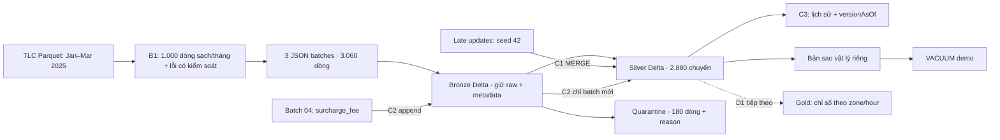
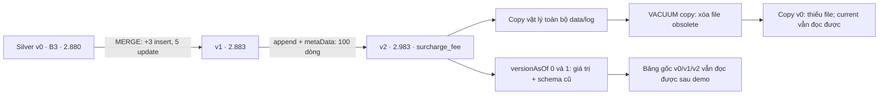
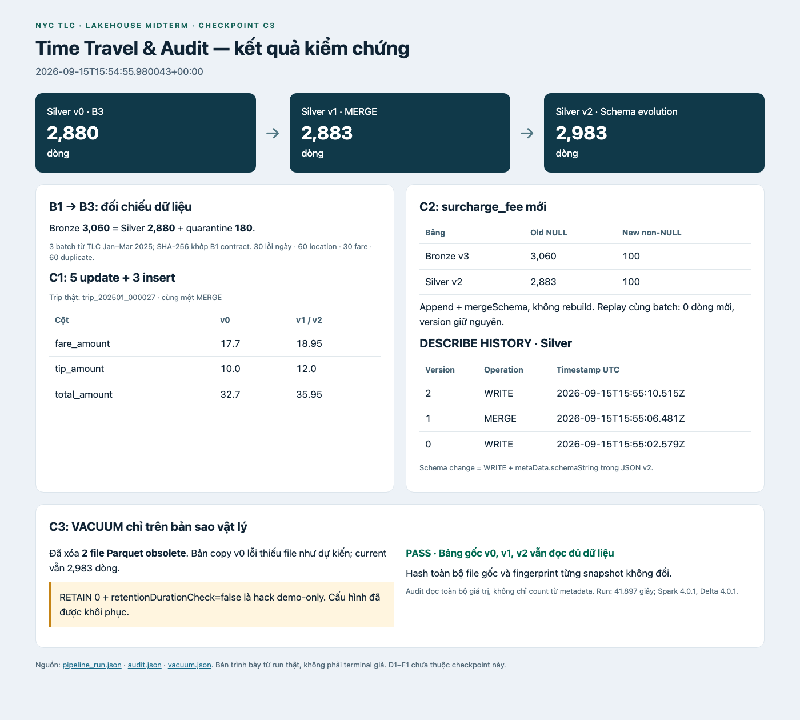
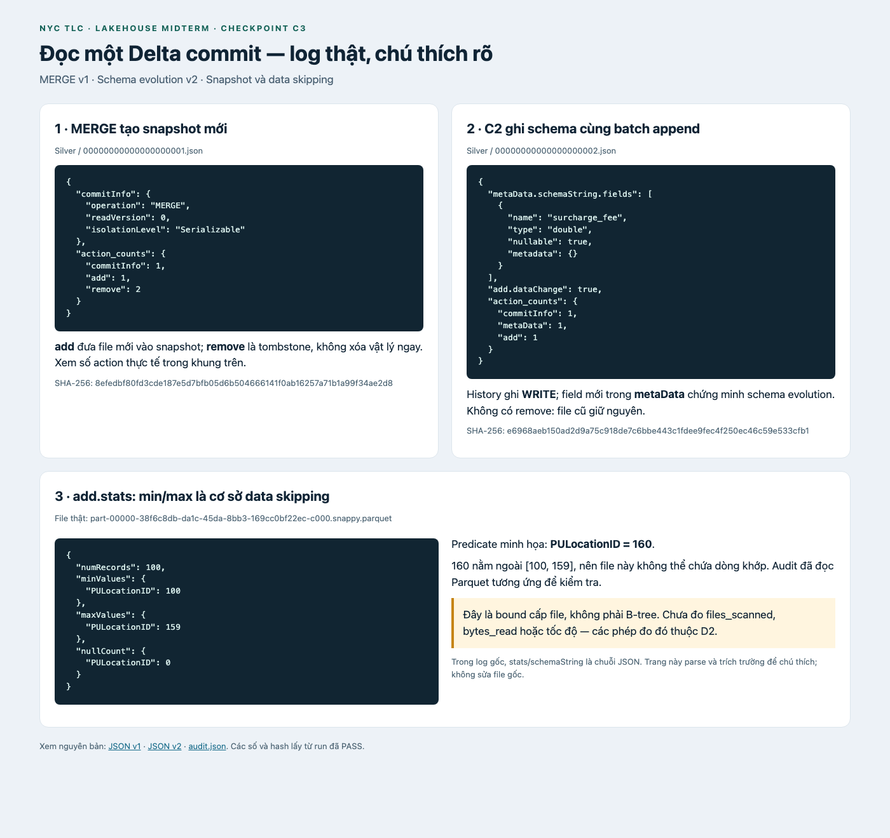

# Delta Lakehouse Architecture & Storage Optimization

## 1. Phạm vi và đối chiếu rubric

Checkpoint này triển khai đến **C3** trên PySpark 4.0.1 / Delta Lake 4.0.1,
Python 3.11, Java 17. D1–F1 là phần tiếp theo, chưa được tính là hoàn thành.
`lakehouse_pipeline.py` hiện chạy từ xác minh B1 đến C3; chưa tạo Gold hoặc benchmark.

| Milestone | Sản phẩm trong repo | Tiêu chí nghiệm thu |
|---|---|---|
| A1 | README, requirements, config, runner, report, `docs/SLIDE_OUTLINE.md` | Môi trường và entry point rõ ràng; có khung các phần còn lại |
| A2 | Mục 2–3 và sơ đồ dưới đây | So sánh ba kiến trúc, Delta, phân tầng và phản biện |
| B1 | `src/generator.py`, contract, manifest, checksums | Ba batch có đủ bốn nhóm lỗi, nguồn TLC kiểm chứng được |
| B2 | `src/bronze.py` | 3.060 dòng, đủ metadata, không loại lỗi |
| B3 | `src/silver.py`, tests | 2.880 Silver + 180 quarantine, đúng B1-v1.0 |
| C1 | `src/cdc_merge.py` | Một MERGE có update và insert; đối chiếu giá trị lẫn số dòng |
| C2 | `src/schema_evolution.py` | Append hai tầng, schema mới, dòng cũ NULL, replay không trùng |
| C3 | `src/time_travel.py`, evidence | Hai version cũ đọc được, history/log thật, VACUUM bản sao |
| D1–F1 | Mục 9–12 là khung bàn giao | Chưa có kết quả Gold, performance, E2 toàn pipeline hoặc deck cuối |

Rubric gốc dành 30 điểm cho lý thuyết, 25 cho Medallion pipeline, 25 cho
upsert/schema evolution/time travel, 10 cho tối ưu và 10 cho code/demo.
Checkpoint C3 đóng góp các hạng mục tương ứng, không đồng nghĩa đã đạt đủ 100 điểm.

## 2. Data Warehouse, Data Lake và Lakehouse

| Góc nhìn | Data Warehouse | Data Lake | Lakehouse |
|---|---|---|---|
| Tổ chức dữ liệu | Bảng có mô hình phục vụ phân tích | File trên HDFS/object storage | File mở cùng metadata và giao dịch cấp bảng |
| Schema | Thường chuẩn hóa trước khi nạp | Diễn giải khi đọc | Giữ landing linh hoạt; enforce/evolve tại bảng |
| Công việc phù hợp | SQL, BI, mô hình nghiệp vụ ổn định | Lưu raw, xử lý nhiều dạng dữ liệu | SQL, data engineering, ML trên bảng dùng chung |
| Trách nhiệm vận hành | Mô hình hóa và tải vào hệ quản trị | Tự quản lý chất lượng, version, tính nhất quán | Quản lý log, retention, bố trí file, engine tương thích |

Đây là so sánh định hướng, không phải khẳng định mọi warehouse hiện đại đều
đóng hoặc mọi data lake đều thiếu governance. Armbrust et al. đề xuất kết hợp
định dạng mở, quản lý đáng tin cậy và phân tích nâng cao để giảm số hệ thống
phải đồng bộ. Kết quả của một hệ thống trong bài báo không chứng minh lakehouse
luôn nhanh/rẻ hơn warehouse trong mọi workload.
[Armbrust et al., CIDR 2021](https://www.cidrdb.org/cidr2021/papers/cidr2021_paper17.pdf).

Trong project, Delta bổ sung transaction log trên Parquet. Schema enforcement
kiểm tra tương thích khi ghi; schema evolution cho phép thêm cột có chủ đích.
Chất lượng nghiệp vụ vẫn do code đảm nhiệm: Delta không tự biết fare âm là lỗi,
cũng không tự đảm bảo `trip_id` duy nhất theo contract của nhóm.

## 3. Medallion Architecture và giới hạn thiết kế



Bronze lưu bằng chứng nguồn và ba cột provenance, giúp đối chiếu/reprocess.
Silver có kiểu nhất quán và khóa đã dedup, phù hợp làm đầu vào cho CDC và phân tích.
Quarantine lưu giá trị raw cùng lý do; nhóm có thể giải thích tại sao một chuyến
không được đưa vào Silver. Gold sau này chuyển dữ liệu chuyến thành chỉ số nghiệp vụ.
Ba tầng là quy ước tổ chức của pipeline, không phải ba loại format Delta khác nhau.

Phản biện của nhóm: mỗi lần materialize qua một tầng tăng I/O, dung lượng và độ
trễ; dữ liệu Bronze mới có thể chưa xuất hiện ở Silver nếu bước sau thất bại.
Một Silver chỉ sao chép cấu trúc từng producer còn đẩy việc thống nhất định nghĩa
sang người dùng. Vì vậy cần contract chung, provenance và kiểm tra theo nhu cầu
phân tích, không thêm tầng chỉ vì tên kiến trúc. Batch nhỏ và máy local ở đây
minh họa ngữ nghĩa, chưa đánh giá SLA streaming hay khả năng scale.

## 4. B1–B3: nguồn, contract và chất lượng

Nguồn là ba Parquet Yellow Taxi chính thức tháng 01–03/2025, đã lưu số dòng,
kích thước và SHA-256 ở [source manifest](docs/source_data_manifest.md).
B1 lấy 1.000 dòng hợp lệ đầu tiên mỗi tháng, gán ID và chèn lỗi seed cố định.
Đây không phải mẫu xác suất đại diện toàn NYC. `trip_id` là khóa do project tạo.
Runner kiểm SHA-256 ba JSON trước khi xử lý; không tải lại dữ liệu mỗi lần chạy.

| Nhóm rejected | Mỗi batch | Tổng ba batch |
|---|---:|---:|
| INVALID_PICKUP_DATETIME | 10 | 30 |
| MISSING_LOCATION (PU hoặc DO) | 20 | 60 |
| INVALID_FARE (fare ≤ 0) | 10 | 30 |
| DUPLICATE_TRIP (bản dư) | 20 | 60 |
| Tổng | 60 | 180 |

Bronze append đủ 1.020 dòng/batch và gắn `_ingest_ts`, `_source_file`, `_batch_id`.
Silver dùng parser `CORRECTED`, UTC, format `yyyy-MM-dd HH:mm:ss`, và phép chuyển
kiểu an toàn trong ANSI mode. Sau loại lỗi pickup/location/fare, dedup dùng
`dropDuplicates(["trip_id"])`. Quarantine giữ N−1 bản dư bằng multiset subtraction.
Đối chiếu 2.880 + 180 = 3.060 diễn ra trước khi ghi Silver.

Không thêm rule thứ năm: ví dụ fare NULL/không parse được không tự động thỏa
`fare <= 0`. Đây là giới hạn cố ý của contract B1-v1.0; production cần một quyết
định nghiệp vụ riêng. B3 là rebuild: phải chạy trước C1/C2, vì overwrite sau CDC
sẽ thay current state. Bronze và hai output B3 là các transaction riêng.

## 5. C1: CDC và MERGE INTO

CDC là cách chuyển thay đổi của nguồn sang downstream thay vì tải lại toàn bộ
trạng thái. Một thiết kế thực tế còn cần event ID, thứ tự/offset, delete và chính
sách xử lý sự kiện cũ đến muộn. Project mô phỏng một batch late-arriving bằng
Parquet; không triển khai connector đọc database log hoặc Delta Change Data Feed.

Fixture chọn khóa thật từ Silver theo thứ tự SHA-256 của `seed:trip_id`, seed 42.
Năm chuyến nhận fare +1,25, tip +2, total +3,25. Ba chuyến mới có khóa riêng và
đầy đủ cột Silver. Các số tiền là giá trị thay thế tuyệt đối được đóng băng trong
fixture; chạy lại fixture không cộng tiền lần nữa. Metadata của bản ghi cũ giữ nguyên;
bản ghi insert có provenance của fixture CDC.

Một MERGE match theo `trip_id`: matched chỉ update fare/tip/total khi giá trị khác;
unmatched insert toàn bộ dòng. Code kiểm duplicate key, schema và fixture trước ghi,
đếm matched/unmatched trước MERGE, rồi đối chiếu số dòng, mọi giá trị persisted và
operation metrics. Điều kiện của lần chạy mới là updated > 0 và
`after = before + inserted`. Replay hợp lệ có thể updated = 0.

```text
Silver trước: 2.880
Source CDC: 8 = 5 matched + 3 unmatched
MERGE: 5 updated + 3 inserted
Silver sau: 2.883
```

Chi tiết fixture và giá trị trước/sau nằm trong evidence. Mô hình này có một writer;
kiểm tra trước MERGE không phải cơ chế đảm bảo exactly-once cho nhiều writer hoặc
các batch CDC đến sai thứ tự. C1 kế thừa ý tưởng update ba cột từ branch
`feat/c1-cdc-merge` (`8f52b73`), bổ sung fixture, runtime và kiểm chứng để tích hợp B3.

## 6. C2: Schema Evolution ở cả Bronze và Silver

`batch_04.json` có 100 dòng tổng hợp và cột **surcharge_fee** kiểu double. Đây là
cột giả lập, khác `cbd_congestion_fee` của TLC 2025 mà B1 đã loại khỏi contract.
Bronze giữ raw rồi Silver chỉ xử lý batch mới bằng cùng parser/rules B3.
Cả hai dùng `append` + `mergeSchema=true`; không rebuild hoặc overwrite bảng.

Kết quả đã xác minh trên run mới: Bronze 3.160 dòng (3.060 cũ NULL, 100 mới có fee);
Silver 2.983 dòng (2.883 cũ NULL, 100 mới có fee). Kiểm tra multiset xác nhận dữ liệu
cũ còn nguyên. Retry cùng batch ID/nội dung không append lần hai; đổi nội dung mà
dùng lại ID bị từ chối. Hai tầng commit riêng, vì vậy retry sau khi Bronze thành
công nhưng Silver chưa chạy có thể tiếp tục ở Silver.

`DESCRIBE HISTORY` thể hiện commit `WRITE`, không có operation tên “SCHEMA EVOLUTION”.
Bằng chứng schema change phải kết hợp `metaData.schemaString` trong JSON commit
và so sánh schema lịch sử. Run mới có schema change ở Bronze v3 và Silver v2;
version không dùng chung giữa các bảng. Screenshot C2 cũ trong repo thuộc lần chạy
riêng của tác giả, không phải bằng chứng cho timeline tích hợp C1→C2→C3 này.

## 7. C3: Delta Log, ACID và Time Travel

### 7.1 Transaction log và snapshot

Delta lưu chuỗi commit có version trong `_delta_log`. Với run nhỏ này, JSON v0
mô tả khởi tạo; v1 ghi MERGE; v2 ghi append có schema mới. `add` đưa file vào
snapshot; `remove` loại file khỏi snapshot hiện tại nhưng chưa xóa vật lý.
`metaData` lưu schema và cấu hình; `protocol` nêu khả năng reader/writer cần có;
`commitInfo` hỗ trợ audit. Snapshot được dựng từ các action đến version chọn,
có thể bắt đầu từ checkpoint rồi áp dụng commit sau checkpoint.
[Delta protocol 4.0.1](https://github.com/delta-io/delta/blob/v4.0.1/PROTOCOL.md).

### 7.2 ACID, optimistic concurrency và isolation

Atomicity: một commit công bố tập thay đổi của một bảng. Consistency: engine
thực thi schema/protocol, còn rule nghiệp vụ do pipeline kiểm tra. Isolation:
reader tiếp tục đọc snapshot nhất quán; writer không làm reader thấy nửa kết quả.
Durability phụ thuộc log/data đã commit và bảo đảm của storage được hỗ trợ.
Writer dùng optimistic concurrency: đọc snapshot, ghi file mới, kiểm xung đột
với commit phát sinh rồi commit hoặc báo lỗi.
[Delta concurrency control](https://docs.delta.io/concurrency-control/).

Trong project, B3 pin version Bronze, C1/C3 đọc `versionAsOf` rõ ràng. Các phép
so sánh đọc toàn bộ giá trị để tránh count được tối ưu chỉ từ metadata. Thí nghiệm
này xác minh lịch sử tuần tự; không giả nhận đã stress-test nhiều writer. ACID
của một bảng không biến Bronze→Silver hoặc Silver→quarantine thành transaction
xuyên nhiều bảng. Read snapshot isolation cũng không có nghĩa hai writer sửa
cùng dữ liệu sẽ luôn cùng thành công.

### 7.3 Timeline kiểm chứng



`audit.json` lưu count, schema, SHA-256 của tập giá trị đã materialize, một trip
cập nhật và số khóa insert nhìn thấy ở từng version. Hai version 0 và 1 đều là
version cũ sau C2. C3 kiểm v0 có số tiền cũ, v1/v2 có số tiền đã sửa; v0 chưa có
ba insert; v0/v1 chưa có cột fee. History của cả Bronze và Silver cùng JSON commit
được chép nguyên bản vào evidence, kèm hash.

### 7.4 VACUUM và retention

VACUUM xóa file dữ liệu không còn cần trong cửa sổ retention; nó không trực tiếp
xóa transaction log. Mặc định retention data là 7 ngày và log là 30 ngày. Giữ log
không đủ để đọc version nếu file Parquet của version đó đã bị xóa.
[Delta table utilities](https://docs.delta.io/delta-utility/).

Demo tạo **bản sao vật lý riêng**, gồm data và log, không dùng shallow clone/hardlink.
Code từ chối đường dẫn trùng/lồng nhau, symlink hoặc action trỏ ra ngoài bảng.
Chỉ trên bản copy mới này, tạm đặt
`spark.databricks.delta.retentionDurationCheck.enabled=false`, chạy DRY RUN rồi
`VACUUM ... RETAIN 0 HOURS`, và khôi phục cấu hình bằng `finally`.
**Đây là hack demo-only**, không phải cấu hình vận hành được khuyến nghị.

Nghiệm thu yêu cầu có file obsolete bị xóa thật, snapshot current của copy giữ
nguyên, version cũ của copy lỗi vì thiếu file, còn v0/v1/v2 của bảng gốc vẫn đọc
được và mọi hash file gốc giữ nguyên. Phần thất bại có chủ đích chỉ xảy ra ở copy;
không được che một exception Spark khác như thể đó là kết quả mong muốn.

### 7.5 Chú thích log và cơ chế data skipping

Mỗi `add.stats` là chuỗi JSON chứa `numRecords`, `minValues`, `maxValues`, `nullCount`.
Ví dụ, nếu file có PULocationID trong [100,159], predicate `PULocationID = 160`
không thể khớp file đó. Engine có thể bỏ file dựa trên bound; đây là thống kê cấp
file, không phải B-tree hoặc danh sách chính xác mọi giá trị. Nếu predicate nằm
trong khoảng thì vẫn có thể không có dòng khớp. Run sẽ dùng bounds thật của file
được chọn, không hardcode ví dụ này.
[Delta optimizations](https://docs.delta.io/optimizations-oss/).

Ảnh/log được trình bày từ action thực tế, có tên file và hash để truy ngược.
Min/max hiện diện không tự chứng minh một tỷ lệ tăng tốc hoặc số byte đã bỏ đọc;
đó là việc đo của D2. Bản audit chỉ xác minh bound với dữ liệu Parquet tương ứng.

## 8. Tái lập và nghiệm thu checkpoint

Hướng dẫn chạy nằm ở [README](README.md) và [demo C3](docs/C3_TIME_TRAVEL.md).
Mỗi run có thư mục mới dưới `data/c3_demo/`; B2 chạy một lần, B3 trước C1/C2.
Các test dùng thư mục tạm riêng. Evidence nghiệm thu được lưu trong
`docs/evidence/c3/`, còn Parquet và log Spark đầy đủ ở `data/` không đưa lên Git.
Đếm toàn bộ dữ liệu/hashing trong C3 được thiết kế cho khoảng 3.000 dòng; cần
thay bằng kiểm chứng phân tán nếu scale lên toàn bộ TLC.

Lần nghiệm thu ngày 15/09/2026 tại `data/c3_demo/official_20260915_final`
hoàn thành trong **41,897 giây** (phần runner sau khi Spark khởi tạo, không gồm
download hay khởi động JVM). Silver v0/v1/v2 lần lượt 2.880/2.883/2.983 dòng;
Bronze cuối 3.160. VACUUM copy xóa 2 file cũ, original giữ nguyên cả ba version.
Regression suite có **15 test pass**, gồm 5 test B3 và 10 test Delta core.
Xem [kết quả run](docs/evidence/c3/pipeline_run.json),
[JUnit](docs/evidence/c3/tests.xml), [manifest code/evidence](docs/evidence/c3/manifest.json).





## 9. Gold aggregation — D1 tiếp theo

Cần triển khai theo PULocationID và giờ UTC: average fare, trung bình tỷ lệ
`tip/fare` theo chuyến với guard `fare > 0`, và earnings `fare + tip + extra`.
Chưa có bảng Gold được xác nhận tại checkpoint này.

## 10. Performance engineering và benchmark — D2 tiếp theo

Small file problem: nhiều file nhỏ tăng chi phí mở/list file và scheduling.
Compaction gom file nhằm giảm overhead; Z-order gom các giá trị liên quan để
bound thống kê có tính chọn lọc hơn. Hiệu quả phụ thuộc layout, predicate và
dữ liệu; không phải index tra cứu điểm.
[Delta optimizations](https://docs.delta.io/optimizations-oss/).

Cần đo trên Silver/nhánh Parquet theo bảng phân công: baseline, ZORDER một cột,
ZORDER hai cột và điều kiện clustering mà runtime thực tế hỗ trợ. Chạy xen kẽ,
ít nhất ba lần/điều kiện, báo median, files/bytes và kiểm soát cache. Chưa có
benchmark hay khẳng định % improvement. Nhóm cần thống nhất mâu thuẫn giữa cột
Verify (bốn điều kiện) và Done when (ba trạng thái) trước khi chốt D2.

## 11. Tích hợp và kiểm thử toàn pipeline — E1/E2 tiếp theo

Runner hiện kết thúc ở C3. Cần nối Gold, benchmark và kiểm thử lần chạy thứ hai
của toàn pipeline sau D2. Replay C1/C2 ở checkpoint này không thay thế E2 hoặc
test công thức tip% của Gold.

## 12. Slides, demo cuối và bàn giao — F1 tiếp theo

Khung slide nằm ở `docs/SLIDE_OUTLINE.md`; demo C3 có hướng dẫn và evidence dự phòng.
Cần hoàn thiện PowerPoint, số liệu performance và rehearsal toàn bộ bài 10–15 phút
sau D2/E2. Báo cáo hiện chưa phải bản nộp cuối.

## 13. Tài liệu tham khảo

Các nguồn được liên kết ngay tại phần sử dụng. Trích dẫn học thuật A2 là:
Armbrust, M., Ghodsi, A., Xin, R., & Zaharia, M. (2021). *Lakehouse: A New Generation
of Open Platforms that Unify Data Warehousing and Advanced Analytics*. CIDR 2021.
Đường dẫn DOI trong bảng phân công không dùng thay cho bài CIDR này; report dẫn
trực tiếp bản chính thức từ CIDR. Data contract, fixture và kết quả run là evidence
nội bộ của nhóm, được phân biệt với các khẳng định trong tài liệu Delta.
