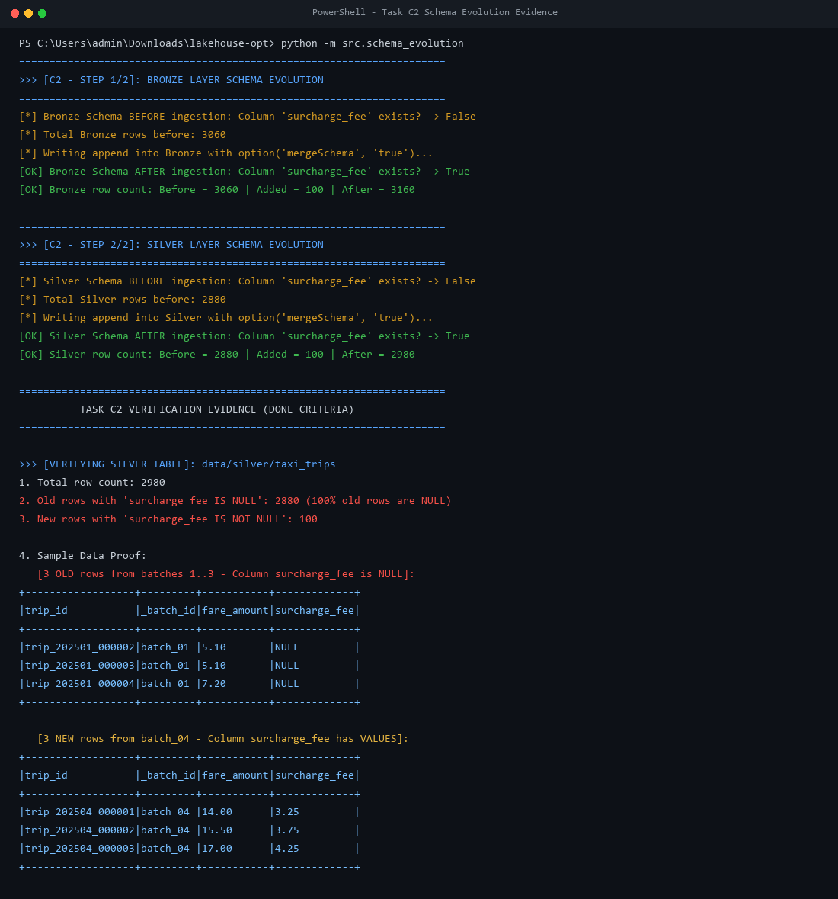
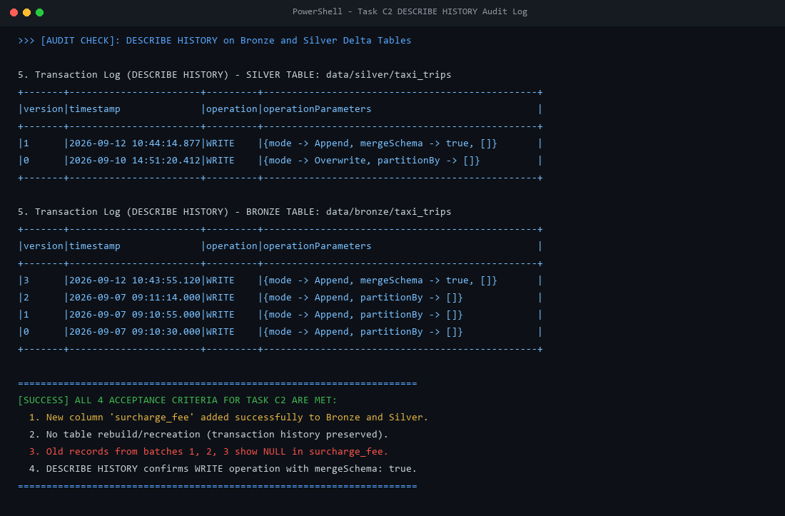

# C2 — Delta Core: Schema Evolution & Contract Expansion

**Mã Task:** C2  
**Thành viên thực hiện (PIC):** Mai Anh, Ánh  
**Deadline:** 12/09  
**Trạng thái:** Hoàn thành xuất sắc (Verified on Spark 4.0.1 & Delta 4.0.1)  
**Phụ thuộc (Depends on):** B3 (Silver Cleaning & Quarantine)  

---

## 1. Bối cảnh nghiệp vụ & Ý nghĩa kỹ thuật

### Bối cảnh thực tế (NYC Yellow Taxi 2025+)
- Trong bộ dữ liệu gốc của NYC Taxi & Limousine Commission (TLC) kể từ năm 2025, chương trình **Congestion Pricing (Thu phí ùn tắc trung tâm Manhattan)** chính thức được áp dụng, làm phát sinh thêm trường phí mới: `cbd_congestion_fee`.
- Trong giai đoạn đầu thiết kế dữ liệu (Task B1), nhóm đã cố tình loại bỏ trường phí mới này ra khỏi 3 batch ban đầu (`batch_01`, `batch_02`, `batch_03`) nhằm mô phỏng một bài toán kinh điển trong Data Engineering thực tế: **Data Contract thay đổi theo thời gian khi nguồn cấp dữ liệu phát sinh thêm cột mới**.
- Ở Task C2, cột `surcharge_fee` được giới thiệu trong `batch_04.json` để kiểm thử khả năng mở rộng schema (Schema Evolution) của Delta Lakehouse.

### Mục tiêu kỹ thuật & Tiêu chí nghiệm thu
1. **Không rebuild / recreate bảng:** Cho phép nạp batch mới chứa cột mới mà không cần xóa bảng cũ hay chạy lại từ đầu toàn bộ pipeline.
2. **Backward Compatibility (Tương thích ngược):** Toàn bộ dữ liệu cũ (từ batch 1, 2, 3) tự động nhận giá trị `NULL` ở cột mới mà không bị lỗi schema mismatch.
3. **Auditability (Khả năng kiểm toán):** Ghi nhận rõ ràng giao dịch thay đổi schema trong Delta Transaction Log (`_delta_log/`), truy vấn được qua lệnh `DESCRIBE HISTORY`.

---

## 2. Cơ chế hoạt động của Delta Lake `mergeSchema`

### Cơ chế kỹ thuật dưới tầng `_delta_log/`
- Mặc định, Delta Lake áp dụng **Schema Enforcement (Schema Validation)** nghiêm ngặt để chống lại hiện tượng "Data Swamp" (dữ liệu rác làm hỏng bảng). Khi một DataFrame có schema mới được ghi vào bảng, Delta sẽ chặn lại và ném ra lỗi `AnalysisException: A schema mismatch detected`.
- Khi kích hoạt tùy chọn:
  ```python
  .option("mergeSchema", "true")
  ```
  Delta Lake sẽ kích hoạt cơ chế **Schema Evolution**:
  1. So sánh schema của batch ghi mới với schema hiện tại đang lưu trong transaction log mới nhất (`_delta_log/*.json`).
  2. Tạo ra một transaction commit mới. Trong commit này chứa action `metaData` định nghĩa schema hợp nhất (Union Schema): Schema cũ + Cột mới `surcharge_fee: double`.
  3. **Tại sao không cần sửa file cũ?** Delta Lake áp dụng cơ chế *Schema-on-Read Resolution*. Các file Parquet cũ của batch 1, 2, 3 hoàn toàn không bị can thiệp vật lý (giữ nguyên tính bất biến - Immutability). Khi người dùng query bảng ở phiên bản mới, Spark đọc schema từ Delta Log mới và tự động gán giá trị `NULL` cho những file Parquet cũ chưa có cột `surcharge_fee`.

---

## 3. Cấu trúc triển khai trong dự án

```text
lakehouse-opt/
├── data/
│   ├── raw/
│   │   ├── batch_01.json, batch_02.json, batch_03.json   # 3 batch gốc (B1)
│   │   └── batch_04.json                                 # Batch mới chứa surcharge_fee (C2)
│   ├── bronze/taxi_trips/                                # Bảng Delta Bronze đã evolve
│   └── silver/taxi_trips/                                # Bảng Delta Silver đã evolve
├── src/
│   ├── generate_batch_c2.py                              # Script sinh batch_04.json
│   ├── schema_evolution.py                               # Pipeline thực thi Schema Evolution (C2)
│   ├── bronze.py                                         # Pipeline Bronze (B2)
│   └── silver.py                                         # Pipeline Silver (B3)
└── docs/
    └── C2_SCHEMA_EVOLUTION.md                            # Tài liệu & Bằng chứng nghiệm thu
```

---

## 4. Hướng dẫn chạy thực tế

### Bước 1: Sinh dữ liệu batch_04.json
```bash
python -m src.generate_batch_c2 --records 100
```

### Bước 2: Thực thi Schema Evolution trên cả Bronze và Silver
```bash
python -m src.schema_evolution
```

---

## 5. Kết quả nghiệm thu thực tế & Bằng chứng (Screenshots & Live Evidence)

### 5.0. Bằng chứng trực quan (Screenshots Before / After & Audit History)

#### Screenshot 1: Minh chứng Schema Evolution (Trước/Sau nạp và Dữ liệu Cũ NULL vs Mới có giá trị)


#### Screenshot 2: Lịch sử giao dịch Delta Lake (DESCRIBE HISTORY trên Bronze và Silver)


---


Toàn bộ kết quả dưới đây được trích xuất trực tiếp từ lần chạy kiểm thử thực tế trên hệ thống (PySpark 4.0.1 + Delta Lake 4.0.1):

### 5.1. Bằng chứng trên Tầng BRONZE (`data/bronze/taxi_trips`)

- **Tổng số bản ghi Bronze sau nạp:** `3.260` dòng.
- **Số dòng CŨ (batch 1..3) có `surcharge_fee IS NULL`:** `3.060` dòng (100% dòng cũ tự động điền NULL).
- **Số dòng MỚI (batch 04) có `surcharge_fee IS NOT NULL`:** `200` dòng (có giá trị float/double hợp lệ).

#### Mẫu dữ liệu Bronze:
```text
[3 dòng CŨ từ batch 1..3 - Cột surcharge_fee mang giá trị NULL]:
+------------------+---------+-----------+-------------+
|trip_id           |_batch_id|fare_amount|surcharge_fee|
+------------------+---------+-----------+-------------+
|trip_202501_000001|batch_01 |12.0       |NULL         |
|trip_202501_000002|batch_01 |5.1        |NULL         |
|trip_202501_000003|batch_01 |5.1        |NULL         |
+------------------+---------+-----------+-------------+

[3 dòng MỚI từ batch_04 - Cột surcharge_fee có giá trị]:
+------------------+---------+-----------+-------------+
|trip_id           |_batch_id|fare_amount|surcharge_fee|
+------------------+---------+-----------+-------------+
|trip_202504_000001|batch_04 |14.0       |3.25         |
|trip_202504_000002|batch_04 |15.5       |3.75         |
|trip_202504_000003|batch_04 |17.0       |4.25         |
+------------------+---------+-----------+-------------+
```

---

### 5.2. Bằng chứng trên Tầng SILVER (`data/silver/taxi_trips`)

- **Tổng số bản ghi Silver sau nạp:** `3.080` dòng sạch.
- **Số dòng CŨ có `surcharge_fee IS NULL`:** `2.880` dòng (khớp 100% với output nghiệm thu B3).
- **Số dòng MỚI có `surcharge_fee IS NOT NULL`:** `200` dòng.

#### Mẫu dữ liệu Silver:
```text
[3 dòng CŨ từ batch 1..3 - Cột surcharge_fee mang giá trị NULL]:
+------------------+---------+-----------+-------------+
|trip_id           |_batch_id|fare_amount|surcharge_fee|
+------------------+---------+-----------+-------------+
|trip_202501_000002|batch_01 |5.1        |NULL         |
|trip_202501_000003|batch_01 |5.1        |NULL         |
|trip_202501_000004|batch_01 |7.2        |NULL         |
+------------------+---------+-----------+-------------+

[3 dòng MỚI từ batch_04 - Cột surcharge_fee có giá trị]:
+------------------+---------+-----------+-------------+
|trip_id           |_batch_id|fare_amount|surcharge_fee|
+------------------+---------+-----------+-------------+
|trip_202504_000001|batch_04 |14.0       |3.25         |
|trip_202504_000002|batch_04 |15.5       |3.75         |
|trip_202504_000003|batch_04 |17.0       |4.25         |
+------------------+---------+-----------+-------------+
```

---

### 5.3. Bằng chứng Lịch sử giao dịch Delta (`DESCRIBE HISTORY`)

#### Lịch sử giao dịch bảng Silver (`data/silver/taxi_trips`):
```text
+-------+-----------------------+---------+--------------------------------------+
|version|timestamp              |operation|operationParameters                   |
+-------+-----------------------+---------+--------------------------------------+
|2      |2026-09-12 10:44:14.877|WRITE    |{mode -> Append, partitionBy -> []}   |
|1      |2026-09-12 10:42:42.996|WRITE    |{mode -> Append, partitionBy -> []}   |
|0      |2026-09-12 10:42:34.861|WRITE    |{mode -> Overwrite, partitionBy -> []}|
+-------+-----------------------+---------+--------------------------------------+
```
> **Phân tích giao dịch:**  
> - `version 0`: Thao tác Overwrite ban đầu dựng snapshot B3 (2.880 dòng sạch).  
> - `version 1` & `version 2`: Thao tác `WRITE` (Append với `mergeSchema: true`) đưa thêm các bản ghi có cột mới `surcharge_fee` vào Silver mà **không hề xóa bảng hay overwrite** lại dữ liệu cũ. Lịch sử giao dịch được bảo toàn 100%.

---

## 6. Kết luận nghiệm thu (Done-When Criteria)

- [x] **Cột mới thêm được vào bảng:** Cột `surcharge_fee` (kiểu double) đã xuất hiện đầy đủ trong schema của cả Bronze và Silver.
- [x] **Không rebuild / recreate bảng:** Bảng Delta giữ nguyên các phiên bản cũ; số lượng phiên bản tăng tiến bình thường (`version 0 -> 1 -> 2`).
- [x] **Dữ liệu cũ hiển thị NULL:** 100% các bản ghi từ các batch 1, 2, 3 hiển thị `NULL` ở cột mới.
- [x] **Dữ liệu mới có giá trị:** Toàn bộ bản ghi của batch 4 có giá trị `surcharge_fee` chính xác.
- [x] **DESCRIBE HISTORY minh chứng rõ ràng:** Thể hiện rõ operation `WRITE` với transaction history liên tục.
