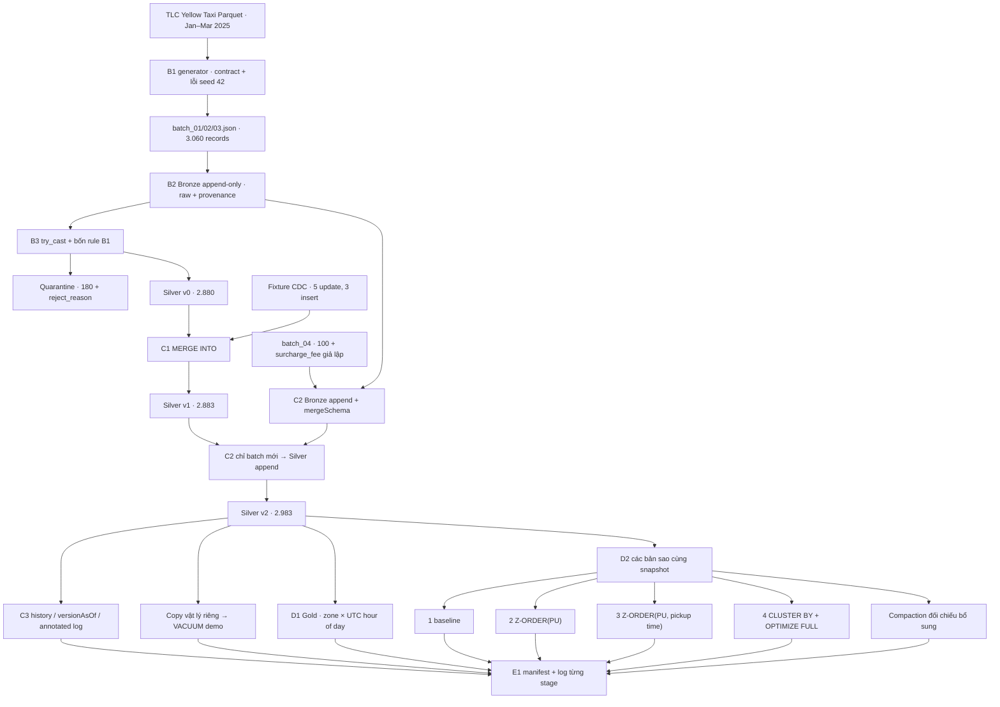

# Kiến trúc A1–E1 và ranh giới transaction



Version ở trên áp dụng cho Silver trong một run mới theo thứ tự cố định.
Bronze có version riêng: ba append đầu tiên là v0/v1/v2, schema change C2 ở v3.
Gold và mỗi bảng benchmark là các Delta table riêng; không cộng version giữa
các bảng. E1 điều phối nhiều transaction, không tạo một transaction ACID xuyên
Bronze, Silver, quarantine, Gold và benchmark.

```mermaid
sequenceDiagram
    participant R as Reader
    participant W as Writer
    participant D as Data files
    participant L as Delta log
    R->>L: Đọc snapshot vN
    W->>L: Đọc vN và metadata
    W->>D: Ghi Parquet mới chưa thuộc snapshot công bố
    W->>L: Kiểm tra commit mới / xung đột
    alt Không xung đột
      W->>L: Commit nguyên tử vN+1 (add/remove/metadata)
    else Xung đột
      L-->>W: Thất bại transaction; cần retry phù hợp
    end
    R->>D: Tiếp tục đọc các file của snapshot vN
```

Đây là mô hình giải thích optimistic concurrency và snapshot isolation;
project kiểm chứng history theo thứ tự, không tự nhận đã chạy stress test nhiều
writer. Reader lịch sử cần cả log lẫn file dữ liệu của version đó. `remove` chỉ
loại file khỏi snapshot mới; VACUUM mới có thể xóa file vật lý hết retention.
[Delta concurrency control](https://docs.delta.io/concurrency-control/).

Bronze giữ provenance để reprocess; Silver áp contract chung; Gold phục vụ chỉ
số nghiệp vụ. Mỗi hop tăng I/O, độ trễ và điểm có thể lỗi. Một Silver chỉ phản
chiếu schema của producer sẽ khiến consumer vẫn phải tự thống nhất định nghĩa.
Vì vậy các lớp phải có contract và mục đích phân tích rõ ràng, không chỉ đổi tên
thư mục. [REPORT mục 2–3](../REPORT.md) trình bày nguồn học thuật và giới hạn.
